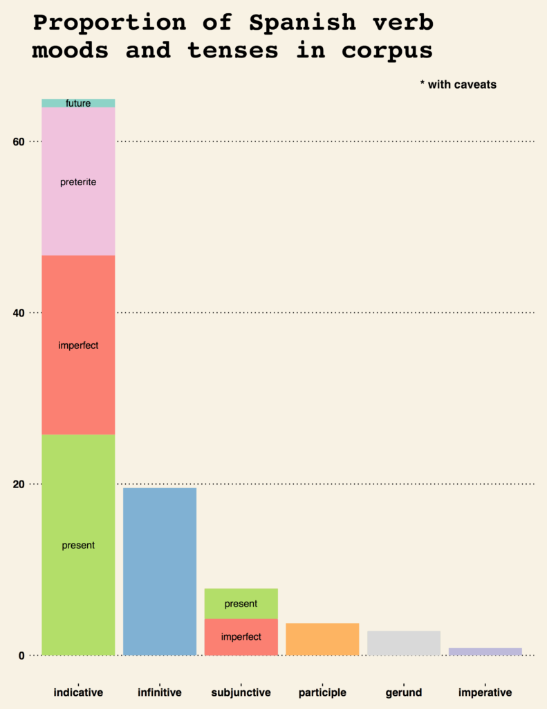

\

# Introduction {#sec:introduction}

Linking data about entities across different data sources is a trivial task if
there is an agreed-upon key that unique identifies each entity, that can be
joined on. Without this common key, though, this _record linkage_ procedure is
substantially less straight-forward and the approach to matching is often
highly-dependent on the domain and particulars of the data sets at hand.

In the realm of medicine and healthcare---owing to the nature of the data
produced and the number of distinct organizations stewarding these
data---linking records _without_ canonicalized unique identifiers is the
rule, rather than the exception. It is then, perhaps, no wonder that the
introduction of the concept in the literature was published by the _American
Journal of Public Health_ in the seminal paper _"Record Linkage"_.[@dunn]

Although a complete history of _record linkage_ and a comprehensive detailing
of the discipline's common techniques is beyond the scope of this paper, we
_will_ have an in-depth discussion and justification of the _specific_
techniques used in our approach to the problem that is the subject of this
paper.

# Background {#sec:background}

## Something

concerned, we use no fewer than 65^[at time of writing] regular expression

| beatle_id | first_name    | last_name         |
| :-------- | :------------ | :---------------  |
| 1         | John          | Lennon            |
| 2         | Paul          | McCartney         |
| 3         | Richard       | Starkey           |
| 4         | George        | Harrison          |

## Exact matches

Before that, though, the first step is to construct a matrix where each
row contains the internal IDs, site names, and addresses for every
distinct pairing. In other words, if the X has $m=3$ records and Y has
$n=4$, this matrix---the _cartesian join_ of both input matrices---would
contain $m \cdot n=12$ rows.

__TODO: ADD DIAGRAM HERE__

using, for example, a nested `for` loop?

Though naive implementations of this algorithm normally have a
computational complexity of $O(m \cdot n)$, there are more sophisticated
approaches that can get this complexity to nearly linear
time.[@andoni]^[This is handy, as this metric is often used in
bioinformatics to align DNA sequences, which are many _many_ characters long]

One of the major string distance measures we use is a more flexible variant of
the edit distance called "Optimal String Alignment."[@comparator], hereafter
referred to as OSA. For example, this algorithm allows for different
"penalties" for each type of edits (insertion, deletion, and substitution)
instead of a uniform const function, as does the simple edit distance
described above.

though having a extremely large edit distance of 28,^[see Appendix 
\ref{metrictransformations} for more information] have a longest common

In that case, we can produce a new column which is the sum of
two times $a$ and $b$. More information can be found in Appendix
\ref{metrictransformations}.]

We can, very efficiently, compute the composite metric detailed above as
a matrix multiplication operation:

\begin{equation}
  \begin{bmatrix}
    0.8  &  0.01 \\ 0.9 & 0.3 \\ 0.1 & 0.3 \\ 0.5 & 0.6 \\ 0.3 & 0.2
  \end{bmatrix}
  %
  \begin{bmatrix}
    2 \\ 1
  \end{bmatrix} 
  =
  \begin{bmatrix}
    1.61 \\ 2.1 \\ 0.5 \\ 1.6 \\ 0.8
  \end{bmatrix}
\end{equation}

The example problem is to find the mean distance between every airport in the
United States. This silly example was chosen because it exhibits polynomial
growth in running time as a function of the number of airports and, thus,
quickly becomes intractable without sampling. It is also easy to parallelize.
Check out figure \ref{spanish-verb-plot}

{#spanish-verb-plot}

# Conclusion {#sec:conclusion}

Lorem ipsum dolor sit amet, consectetur adipiscing elit. Aliquam ornare nibh
tellus, a bibendum urna consectetur et. Etiam massa erat, facilisis nec
sagittis vitae, blandit at dolor. Morbi ultrices fringilla dui vel imperdiet.
Phasellus facilisis velit nec pretium euismod. Ut feugiat neque a purus
consequat, nec congue lacus feugiat. Nunc posuere posuere enim vitae varius.
Morbi in congue orci, pulvinar rhoncus turpis. Donec id mattis neque, vitae
rhoncus erat. Etiam sollicitudin nisl eu velit tincidunt iaculis. Vivamus eget
maximus eros. Maecenas sit amet commodo eros, at condimentum risus. 

\newpage{}

\

# References {-}

\newpage{}

\appendix

# Appendices {-}

# Transformations of distance metrics {#metrictransformations}

(forthcoming)

\

